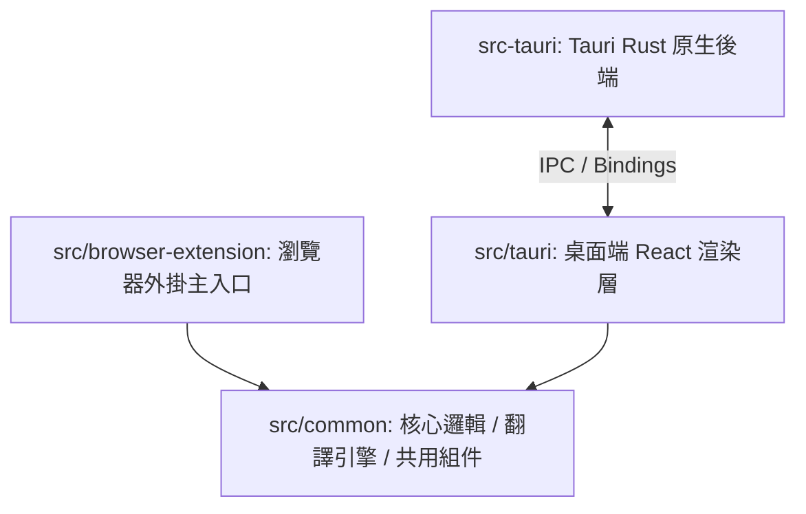

# Agent Playbook: NextAI Translator 🚀

此文件為 AI 助手後續開發的導覽手冊，詳細說明專案架構、關鍵模組運作流程、狀態管理、與 Tauri/瀏覽器擴充功能之通訊機制。

---

## 1. 專案架構與模組關係

本專案採用 Mono-repo 風格的多端共用架構：

*   **`src/common/`**：核心共用庫。
    *   `engines/`：所有 AI 服務提供商（OpenAI, Claude, Gemini, Kimi 等）的具體實作。
    *   `translate.ts`：整合翻譯、潤色、總結、語法分析、程式碼解釋等 Prompts 與呼叫流程。
    *   `store.ts` 與 `hooks/`：控制全域翻譯狀態與 React 生命週期。
*   **`src/browser-extension/`**：瀏覽器擴充外掛，包含 Background script、Popup、Options 頁面。
*   **`src/tauri/`** 與 **`src-tauri/`**：Tauri 桌面端應用程式。Rust 端處理 OCR、全域快捷鍵、視窗管理及原生系統 APIs。

---

## 2. 翻譯核心流程與 AI 引擎 (Engines)

所有的翻譯引擎皆繼承自 `AbstractEngine` 或基於 OpenAI 相容協議的 `AbstractOpenAI`：

### 關鍵檔案位置
*   抽象類別：[abstract-engine.ts](file:///c:/Users/david/Documents/Code/AI_translator/src/common/engines/abstract-engine.ts)
*   OpenAI 基礎類別：[abstract-openai.ts](file:///c:/Users/david/Documents/Code/AI_translator/src/common/engines/abstract-openai.ts)
*   統一入口：[index.ts](file:///c:/Users/david/Documents/Code/AI_translator/src/common/engines/index.ts)

### 如何新增翻譯引擎 (例如：DeepSeek, Groq)
1.  在 `src/common/engines/` 底下建立 `[provider].ts`，實作或繼承 `AbstractEngine` / `AbstractOpenAI`。
2.  在 `interfaces.ts` 中定義或更新 Provider 相關欄位。
3.  在 `index.ts` 匯出並註冊該 Engine。
4.  在 `src/common/types.ts` 和設定畫面 UI 中加入新 Provider 的參數與設定欄位。

---

## 3. 狀態與資料庫管理

*   **全域 UI 狀態**：使用 Zustand 管理。核心狀態定義於 [store.ts](file:///c:/Users/david/Documents/Code/AI_translator/src/common/store.ts)：
    *   `externalOriginalText`
    *   `translatedText`
    *   `isTranslating`
*   **資料儲存**：使用 Dexie (IndexedDB) 做為瀏覽器端與 Tauri 渲染層的本地資料庫，用來儲存翻譯歷史紀錄和自訂 Actions。
    *   資料庫設定：[db.ts](file:///c:/Users/david/Documents/Code/AI_translator/src/common/internal-services/db/index.ts) (若存在的話)。

---

## 4. Tauri IPC 與 Native 整合

桌面端 React 與 Rust 後端的溝通主要透過 `src/tauri/bindings.ts` 與原生呼叫。
*   **Rust 進入點**：[main.rs](file:///c:/Users/david/Documents/Code/AI_translator/src-tauri/src/main.rs)。
*   **視窗與選取區控制**：[windows.rs](file:///c:/Users/david/Documents/Code/AI_translator/src-tauri/src/windows.rs)。
*   **OCR (光學字元辨識)**：[ocr.rs](file:///c:/Users/david/Documents/Code/AI_translator/src-tauri/src/ocr.rs)。

---

## 5. 後續開發規範 (AI 助手必讀)

1.  **縮排與排版**：採用 4 空格縮排，單引號，並加上結尾逗號（Prettier 強制）。
2.  **樣式**：使用 React 18 + Styletron，避免隨意引入 ad-hoc CSS 類別，保持樣式系統統一。
3.  **命名慣例**：
    *   React 組件：`PascalCase`
    *   Hooks / 輔助函式：`camelCase`
    *   常數：`SCREAMING_SNAKE_CASE`
4.  **環境變數與金鑰**：絕不可提交 API Key，需透過系統內部的設定 UI 或 `.env` 檔案載入。
